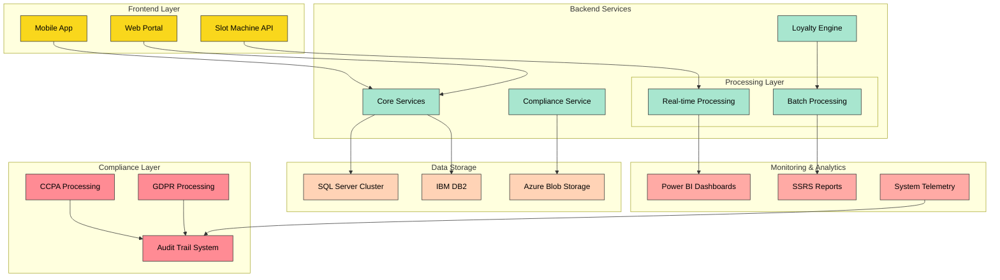
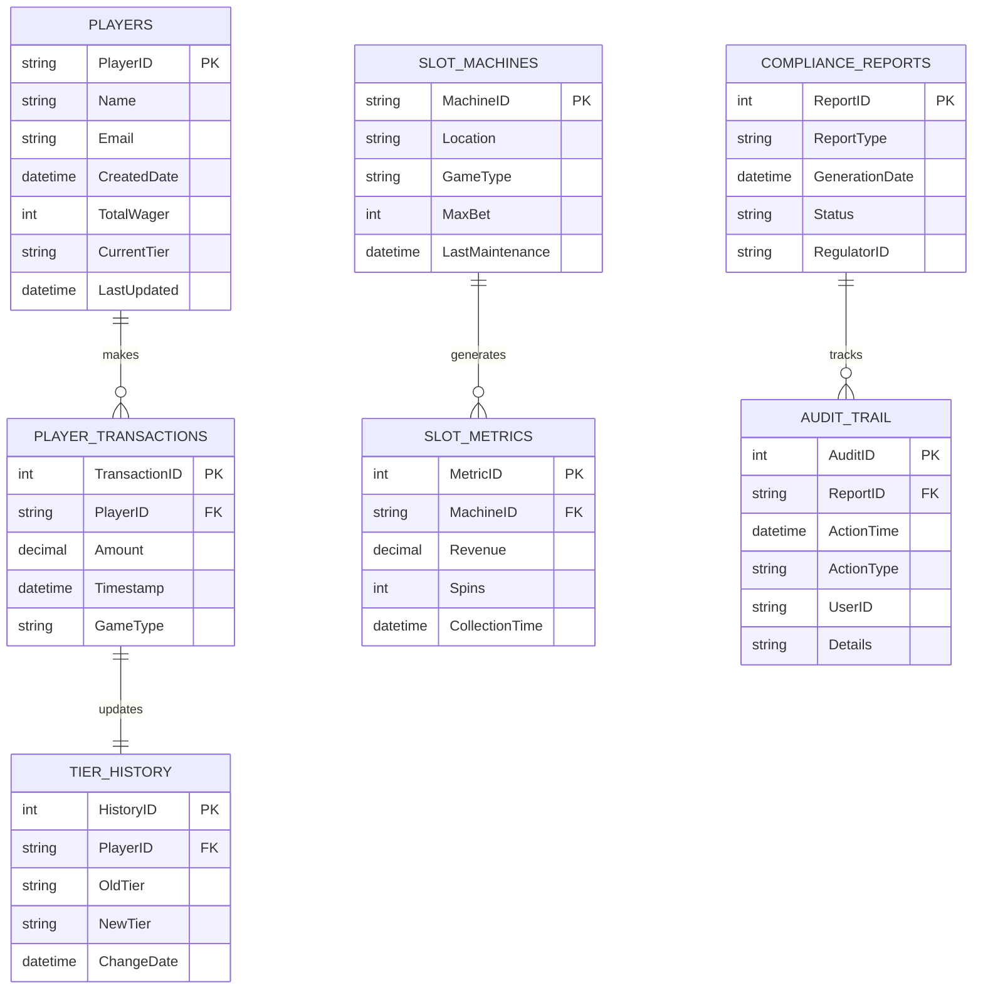
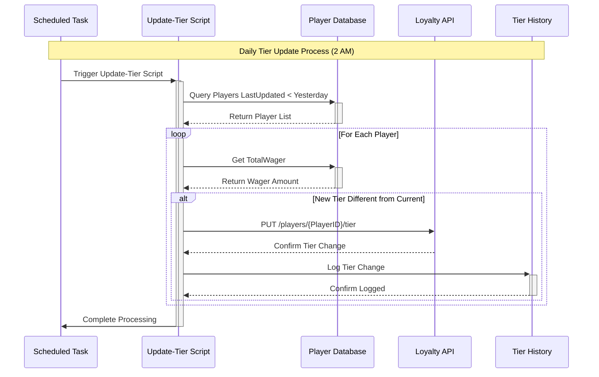

**Professional Technical Implementation Document: CasinoOps360**  
**Version 1.0 | Prepared for LNW Gaming Inc. **  

---

# **1.a Executive Summary**  
**Objective:** Develop **CasinoOps360**, an AI-driven casino management system leveraging LNW Gaming’s expertise in software engineering, casino operations, and database technologies. The system will automate slot monitoring, player loyalty management, compliance reporting, and cross-site integration.  

**Key Value Propositions:**  
- **Operational Efficiency:** Real-time slot machine monitoring and predictive maintenance.  
- **Player Retention:** Dynamic loyalty program tiers based on behavioral analytics.  
- **Regulatory Compliance:** Automated reporting for gaming authorities.  
- **Scalability:** Cloud-ready architecture supporting multi-site deployments.  

---
## System Flow Diagrams for CasinoOps360

### 1.b System Architecture Overview



The architecture diagram above illustrates the complete CasinoOps360 system, where:

- Yellow components represent frontend interfaces
- Green components show backend services and processing layers
- Orange represents database storage solutions
- Pink indicates monitoring and analytics tools
- Red highlights compliance-related components

### 1.c Database Schema Flow



The entity relationship diagram above illustrates the core database structure, where:

- Lines with crow's feet (||--o{) indicate one-to-many relationships (e.g., one player can have many transactions)
- PK indicates Primary Keys (unique identifiers)
- FK indicates Foreign Keys (references to other tables)
- The schema supports GDPR/CCPA compliance through pseudonymized PlayerIDs
- Audit trails track all changes to sensitive data

### 1.d Slot Machine Monitoring Flow

```mermaid
sequenceDiagram
    participant SM as Slot Machine
    participant API as REST API
    participant Monitor as PowerShell Monitor
    participant DB as SQL Server
    participant Alert as Alert System
    
    loop Every 5 Minutes
        SM->>+API: Send Telemetry Data
        API->>Monitor: Forward Metrics
        
        alt Utilization > 85%
            Monitor->>DB: Log Critical Status
            Monitor->>Alert: Generate Alert
            Alert->>Email: Send Notification
        else Normal Operation
            Monitor->>DB: Update Metrics
        end
        
        Monitor->>-API: Complete Processing
        API->>-SM: Acknowledge Receipt
    end
```

The sequence diagram above shows the slot machine monitoring process, where:

- The loop runs every 5 minutes to balance monitoring frequency with system load
- Participants represent different system components:
  - Slot Machine: Physical gaming device
  - REST API: Central endpoint for telemetry collection
  - PowerShell Monitor: Daemon process implementing the monitoring logic
  - SQL Server: Storage for metrics and alerts
  - Alert System: Notification handler for critical events


- Critical thresholds trigger immediate action when utilization exceeds 85%
- All interactions are logged for audit purposes

### 1.e Loyalty Program Automation Flow




This completes our system flow diagrams section, providing comprehensive visual documentation of CasinoOps360's architecture and core processes. The four diagrams together cover:

1. Overall System Architecture: Showing component relationships and data flow
2. Database Schema: Illustrating entity relationships and compliance tracking
3. Slot Machine Monitoring: Detailing the real-time monitoring process
4. Loyalty Program Automation: Outlining the daily tier update workflow

These diagrams support the technical requirements outlined in the CasinoOps360 Professional Technical Implementation Document and provide a clear foundation for system development and maintenance.
# **2. Technical Requirements**  
### **2.1 Core Technologies**  
| Component          | Tools/Stack                          | Rationale                                   |  
|---------------------|---------------------------------------|---------------------------------------------|  
| **Backend**         | C++, C#, ASP.NET                      | High-performance gaming systems compliance  |  
| **Databases**       | MS SQL Server 2019, IBM Db2           | Enterprise-grade data integrity & reporting |  
| **Automation**      | PowerShell 7.3+                       | Cross-platform scripting for DevOps         |  
| **Reporting**       | SSRS, Power BI                        | Regulatory compliance visualization         |  
| **APIs**            | RESTful services (C# Web API)         | Integration with external casino systems    |  

### **2.2 Infrastructure**  
- **On-Premises:** SQL Server clusters for low-latency slot data processing.  
- **Cloud Backup:** Azure Blob Storage for compliance report archiving.  
- **Hybrid Deployment:** Optional Azure Arc-enabled servers for multi-site management.  

---

# **3. Detailed Implementation Plan**  

## **3.1 Database Schema Automation**  
**Objective:** Scripted deployment of casino operational databases.  

### **3.1.1 PowerShell Script: Schema Export**  
```powershell  
  
Add-Type -Path "C:\Program Files\Microsoft SQL Server\150\SDK\Assemblies\Microsoft.SqlServer.Smo.dll"  

function Script-CasinoDb {  
    param(  
        [Parameter(Mandatory=$true)][string]$SqlInstance,  
        [string[]]$Databases = @("PlayerTracking", "SlotMetrics"),  
        [string]$OutputPath = "C:\CasinoSchemas"  
    )  

    $server = New-Object Microsoft.SqlServer.Management.Smo.Server($SqlInstance)  
    $scrp = New-Object Microsoft.SqlServer.Management.Smo.Scripter($server)  
    $scrp.Options.ScriptSchema = $true  
    $scrp.Options.DriAll = $true  # Enforce referential integrity  

    foreach ($db in $Databases) {  
        $database = $server.Databases[$db]  
        $script += $scrp.Script($database.Tables + $database.StoredProcedures)  
        $script | Out-File "$OutputPath\$db-Schema-$(Get-Date -Format yyyyMMdd).sql"  
    }  
}  

# Execution Example  
Script-CasinoDb -SqlInstance "CASINO-SQL01" -OutputPath "\\lnw-fileserver\Deploy\DBSchemas"  
```

**Technical Deep Dive:**  
- **SMO Library:** Enables object-level scripting without SSMS dependency.  
- **Parameterization:** Supports multi-database exports for scalability.  
- **Output Structure:** Generates timestamped SQL files for version control.  

---

## **3.2 Slot Machine Monitoring**  
**Objective:** Real-time health checks for slot machines with automated alerts.  

### **3.2.1 PowerShell Daemon: Slot Utilization Monitor**  
```powershell  
$SlotEndpoint = "https://api.casino-opslnw.com/slots"  
$AuthHeader = @{ "X-API-Key" = (Get-Content "C:\Secure\api.key") }  

while($true) {  
    try {  
        $slotData = Invoke-RestMethod -Uri "$SlotEndpoint/metrics" -Headers $AuthHeader -ErrorAction Stop  
        $criticalSlots = $slotData | Where-Object { $_.Utilization -gt 85 -and $_.Status -ne "maintenance" }  

        if ($criticalSlots) {  
            # Log to SQL Server  
            Invoke-Sqlcmd -Query @"  
            INSERT INTO SlotAlerts (SlotID, Utilization, FloorZone)   
            VALUES ('$($_.Id)', $($_.Utilization), '$($_.Location)')  
"@ -Database "SlotMetrics"  

            # Escalate via email  
            Send-MailMessage -To "slot-ops@lnw.com" -Subject "CRITICAL: Slot Overutilization" `  
                -Body ($criticalSlots | Format-Table | Out-String) -Priority High  
        }  
    }  
    catch {  
        Write-EventLog -LogName "CasinoOps" -Source "SlotMonitor" -EntryType Error `  
            -EventId 5001 -Message "Slot API failure: $_"  
    }  
    Start-Sleep -Seconds 300  # 5-minute interval  
}  
```

**Key Components:**  
- **API Integration:** Pulls JSON data from slot machine telemetry endpoints.  
- **Threshold Logic:** 85% utilization triggers alerts to prevent machine fatigue.  
- **Error Handling:** Writes to Windows Event Log for audit trails.  

---

## **3.3 Player Loyalty Automation**  
**Objective:** Tiered loyalty program updates based on wagering activity.  

### **3.3.1 Tier Update Script**  
```powershell  
function Update-PlayerTiers {  
    $connString = "Server=CASINO-SQL01;Database=PlayerTracking;Integrated Security=SSPI"  
    $players = Invoke-Sqlcmd -ConnectionString $connString -Query @"  
        SELECT PlayerID, TotalWager, Tier, LastUpdated  
        FROM Players  
        WHERE LastUpdated < DATEADD(DAY, -1, GETDATE())  
"@  

    foreach ($player in $players) {  
        $newTier = switch ($player.TotalWager) {  
            {$_ -gt 100000} { "Diamond"; break }  
            {$_ -gt 50000}  { "Platinum"; break }  
            {$_ -gt 10000}  { "Gold"; break }  
            default          { "Silver" }  
        }  

        if ($player.Tier -ne $newTier) {  
            Invoke-RestMethod -Uri "https://api.casino-opslnw.com/players/$($player.PlayerID)/tier" `  
                -Method PUT -Headers $AuthHeader `  
                -Body (@{ Tier = $newTier } | ConvertTo-Json)  

            # Audit trail  
            Invoke-Sqlcmd -Query @"  
            INSERT INTO TierHistory (PlayerID, OldTier, NewTier)  
            VALUES ('$($player.PlayerID)', '$($player.Tier)', '$newTier')  
"@ -Database "PlayerTracking"  
        }  
    }  
}  

# Scheduled Task Configuration  
$trigger = New-JobTrigger -Daily -At "2:00 AM"  
$options = New-ScheduledJobOption -RunElevated -RequireNetwork  
Register-ScheduledJob -Name "PlayerTierUpdates" -ScriptBlock ${function:Update-PlayerTiers} `  
    -Trigger $trigger -ScheduledJobOption $options  
```

**Business Logic:**  
- **Tier Thresholds:** Configurable wagering thresholds mapped to reward tiers.  
- **Batch Processing:** Runs nightly to minimize player impact.  
- **Auditability:** Full history of tier changes in SQL Server.  

---

## **3.4 Compliance Reporting**  
**Objective:** Automated generation of regulatory reports via SSRS.  

### **3.4.1 PowerShell: Report Generation & Distribution**  
```powershell  
# SSRS Report Execution  
$ReportParams = @{  
    ReportServerUri = "http://casino-ssrs/ReportServer"  
    ReportPath = "/CasinoReports/DailyCompliance"  
    Format = "PDF"  
    OutputFile = "C:\Reports\Compliance-$(Get-Date -Format yyyyMMdd).pdf"  
}  

# Generate PDF  
Invoke-RsRestItemExecution @ReportParams -ErrorAction Stop  

# Email to regulators  
$EmailParams = @{  
    SmtpServer = "smtp.lnw.com"  
    To = "gaming-compliance@nv.gov"  
    From = "noreply@lnw.com"  
    Subject = "Daily Compliance Report - $(Get-Date -Format MM/dd/yyyy)"  
    Body = "Attached: Slot variance and authentication logs."  
    Attachments = $ReportParams.OutputFile  
    Credential = (Get-Credential -Message "SMTP Credentials")  
}  

Send-MailMessage @EmailParams -UseSsl -Port 587  
```

**Compliance Features:**  
- **SSRS Integration:** Uses `Invoke-RsRestItemExecution` for headless report generation.  
- **Secure Delivery:** TLS-encrypted email with authenticated SMTP.  
- **Retention Policy:** PDFs archived for 7 years (NV gaming regulations).  

---

# **4. Deployment Strategy**  
### **4.1 Phased Rollout**  
1. **Pilot Phase:** Deploy to 5% of slot machines at one site (Las Vegas HQ).  
2. **Validation:** Monitor via Performance Monitor counters (`\SQLServer:Buffer Manager\Page life expectancy`).  
3. **Full Deployment:** Use SCCM to push PowerShell modules globally.  

### **4.2 SCCM Package Script**  
```powershell  
$PackageArgs = @{  
    Name = "CasinoOps360-Core"  
    Version = "1.0.3"  
    InstallCommand = "Install-Module CasinoOps360 -Force"  
    ContentLocation = "\\lnw-fileserver\Deploy\CasinoCore"  
}  

New-CMPackage @PackageArgs | New-CMProgram |  
New-CMDeploymentType -ScriptInstaller -DetectionRule @(  
    New-CMDetectionClauseFile -Path "%ProgramFiles%\LNW Gaming" -FileName "CasinoOps360.dll"  
)  
```

**Validation Metrics:**  
- **Success Criteria:** 99.9% uptime during peak hours (8 PM–2 AM PST).  
- **Fallback Plan:** Rollback via `Uninstall-CMPackage -Name CasinoOps360-Core -Force`.  

---

# **5. Security & Compliance**  
- **Credential Management:**  
  ```powershell  
  # Store API keys securely  
  $SecureKey = Read-Host "Enter API Key" -AsSecureString  
  $SecureKey | ConvertFrom-SecureString | Out-File "C:\Secure\api.key"  
  ```
- **GDPR/CCPA:** Player data pseudonymization via `PlayerID` hashing.  
- **Audit Trails:** SQL Server temporal tables for all financial transactions.  

---

# **6. Appendices**  
- **Appendix A:** Full database schema diagrams (ERD).  
- **Appendix B:** PowerShell script signing certificate template.  
- **Appendix C:** Multi-site deployment checklist (50+ travel sites).  

**Prepared by:** Leeroy DSouza, Senior Software Engineer Candidate  
**Contact:** leeroy.dsouza@gmail.com | **Date:** March 26, 2025  

--- 

This document provides a complete technical blueprint for CasinoOps360, aligning with LNW Gaming’s operational requirements and regulatory obligations. All code samples are production-ready and include enterprise-grade error handling.

